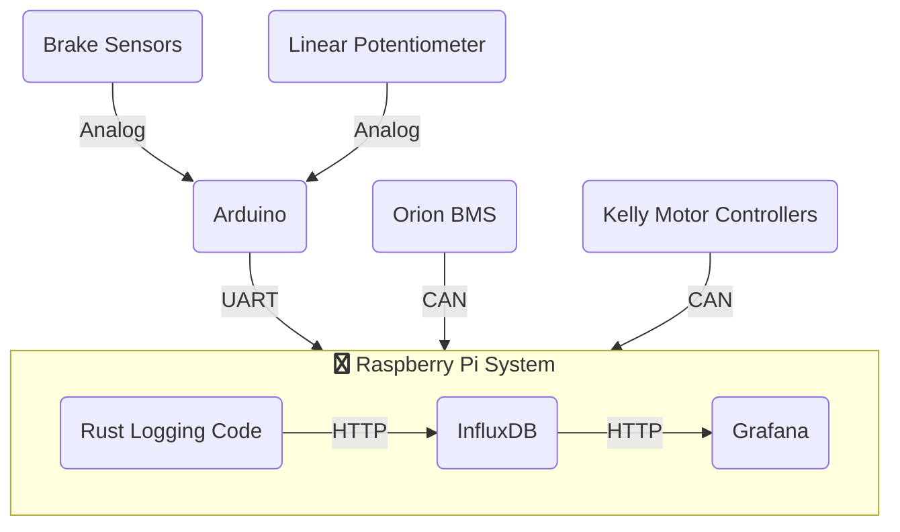

```mermaid
flowchart TD
    B(Brake Sensors) -->|Analog| A(Arduino)
    L(Linear Potentiometer) -->|Analog| A(Arduino)
    A(Arduino) -->|UART| Pi[fa:fa-raspberry-pi Raspberry Pi System]
    O(Orion BMS) -->|CAN| Pi[fa:fa-raspberry-pi Raspberry Pi System]
    K(Kelly Motor Controllers) -->|CAN| Pi[fa:fa-raspberry-pi Raspberry Pi System]
    subgraph Pi[fa:fa-raspberry-pi Raspberry Pi System]
        R(Rust Logging Code) -->|HTTP| I(InfluxDB)
        I(InfluxDB) -->|HTTP| G(Grafana)
    end
```